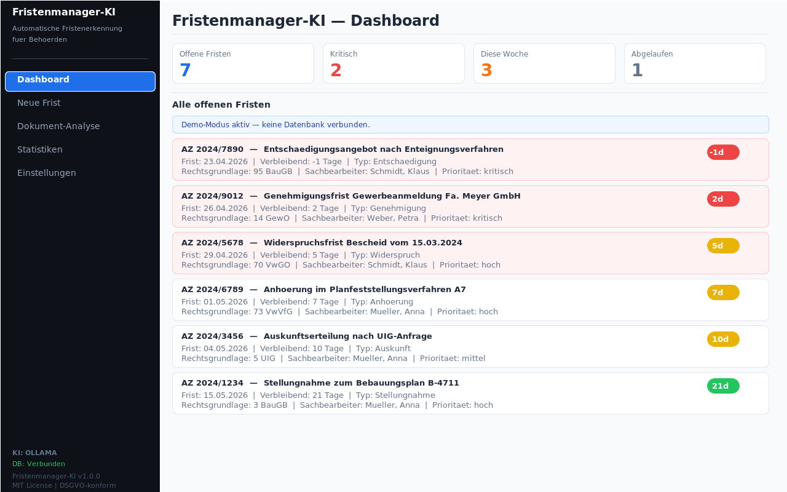
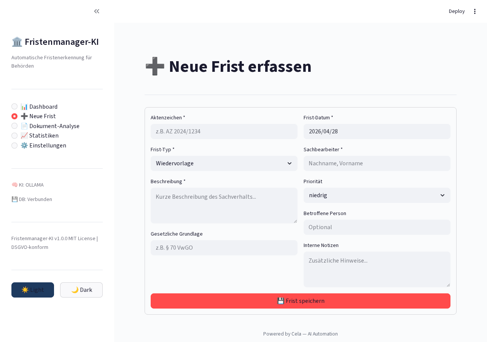
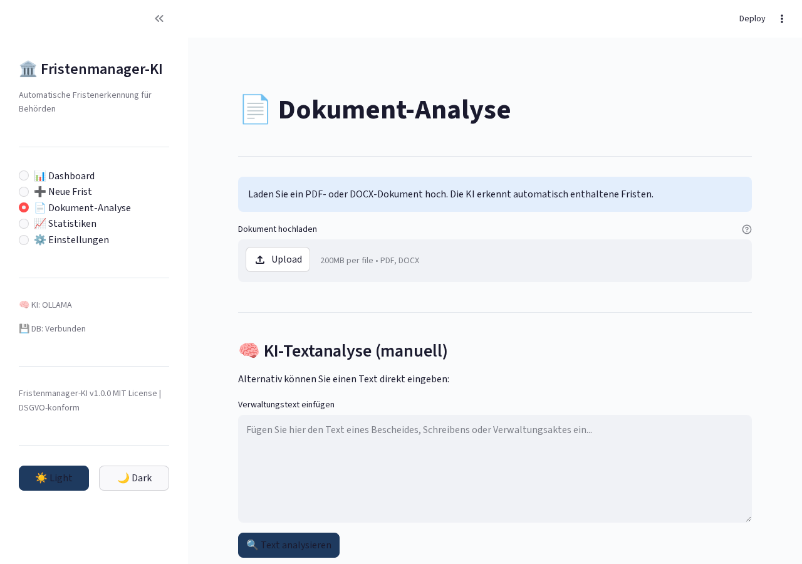
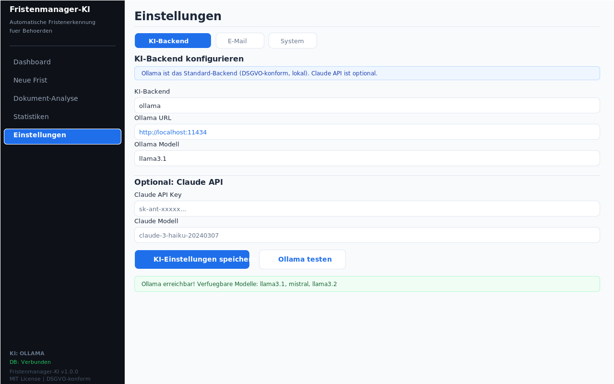
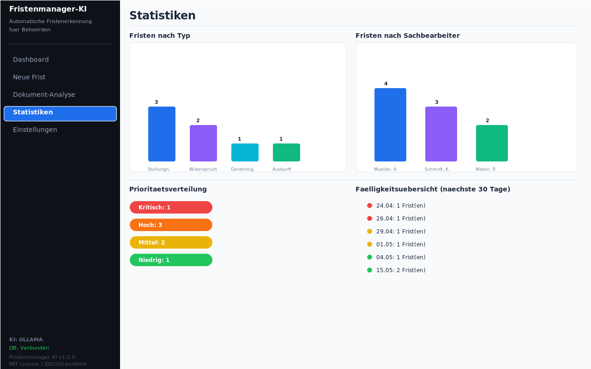

# Fristenmanager Ki

<p align="center">
</p>

    

> Automatische Fristenerkennung und -überwachung für Behörden

## Overview

KI-gestützte Fristenüberwachung für Behörden. Erkennt automatisch Fristen aus Dokumenten, sendet Erinnerungen und verwaltet Wiedervorlagen. Self-hosted mit Ollama.

## Features

- Automatische Fristenerkennung aus Dokumenten
- KI-gestützte Dokumentenanalyse
- Erinnerungs-System mit E-Mail
- Wiedervorlagen-Verwaltung
- Statistik-Dashboard
- DSGVO-konforme Speicherung

## Tech Stack

| Tech | Zweck |
|------|-------|
| Python 3.11+ | Backend |
| Streamlit | Web-Interface |
| Ollama | Lokale KI |
| PostgreSQL | Datenbank |
| Docker | Deployment |

## Quick Start

```bash
pip install -r requirements.txt
streamlit run app.py
```

## Screenshots

**Dashboard mit Fristenübersicht**



**Neue Frist erstellen**



**Dokumentenanalyse zur Fristenerkennung**



**Konfiguration**



**Statistiken und Reports**



---

## Contributing

Beiträge sind willkommen! Bitte erstelle einen Issue oder Pull Request.

## License

MIT License — siehe [LICENSE](LICENSE).

<p align="center">
</p>